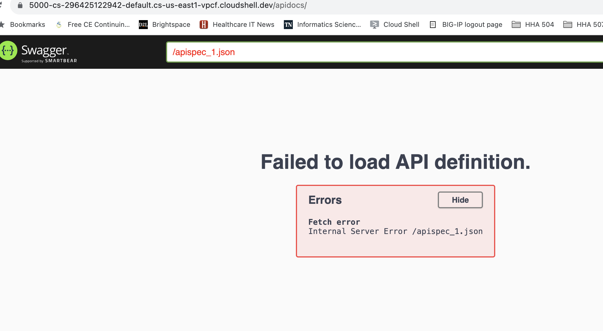

# Week 6: Building and Managing APIs with Flask and Azure

## Flask Endpoint setup

1. Set up flask application in python file as indicated in app_basic.py.
2. Launch flask application locally using the python app_basic.py command in the CLI
3. Test flask endpoint by:
    - Launching local flask app and entering input in the browser line
    - Utilizing curl method to retrieve application

<b> Utilizing browser </b>

<b> Utilizing curl </b>

## Azure API Management Integrations

1. Utilize Visual Studio Code (VSC) to use the Azure CLI
2. Follow this microsoft learn document to create a function in Azure with Python using Visual Code
    https://learn.microsoft.com/en-us/azure/azure-functions/create-first-function-vs-code-python?pivots=python-mode-decorators 
3. Ensure Python and Azure Functions Extension are installed in VSC
4. Run Azure Functions: Install or Update Core Tools in the VSC command pallette
5. Create and deploy a local project using the HttpExample function
6. Sign into Azure on VSC
7. Create a function app and link to the local project
8. Deploy project to Azure using VSC

## API Documentation

<b> OpenAPI documentation </b>

    """
    The endpoint returns the entered blood glucose value.
    ---
    parameters:
    - name: blood_glucose
    in: query
    description: Blood glucose value
    type: integer
    default: 0

    responses:
        200:
            description: Returns the blood glucose value.

    """

## Challenges and Conclusions
Any challenges encountered, solutions tried, and your conclusions.

1. Azure functions was able to be used seamlessly on VSC, and incredibly difficult when using Google cloud shell environment. Upon switching to VSC, following the Microsoft documentation became very simple.

2. OpenAPI is not producing a value when trialing, with the value instead reverting to the default. 

3. Utiliizing the OpenAPI format with the original code in app_basic.py (involving three inputs) proved to be impossible, resulting in errors. Resolved by changing the application input requirements.

